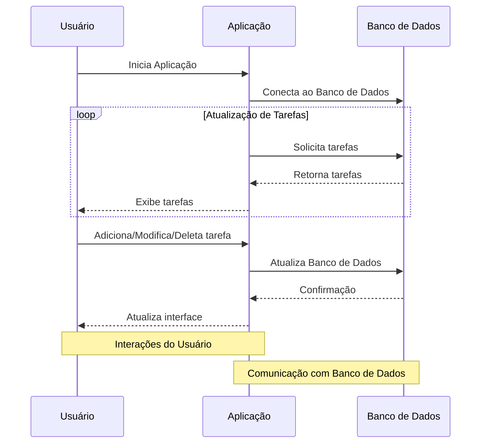

# Documentação e Mapeamento de Requisitos

## Introdução

O código fornecido implementa uma aplicação de lista de tarefas utilizando a biblioteca `tkinter` para a interface gráfica e o banco de dados PostgreSQL do Supabase para armazenamento de dados. A aplicação segue uma arquitetura em camadas, onde a interface gráfica, a lógica de negócios e o acesso ao banco de dados estão separados.

## Arquitetura em Camadas

### Camada de Interface Gráfica

Esta camada é responsável por toda a interação com o usuário, utilizando a biblioteca `tkinter`. Os elementos gráficos, como rótulos, caixas de entrada e botões, são definidos nesta camada.

#### Recursos:
- Labels (rótulos) para exibição de informações.
- Entry (caixas de entrada) para entrada de dados.
- Buttons (botões) para acionar ações.
- Listbox para exibição da lista de tarefas.

#### Principais Processos:
- **create_widgets():** Criação dos elementos gráficos.
- **show_task_info(event):** Exibe informações detalhadas de uma tarefa selecionada.
- **refresh_list():** Atualiza a lista de tarefas na interface.

### Camada de Lógica de Negócios

Nesta camada, estão as funções relacionadas à lógica da aplicação, como adicionar, editar, excluir e visualizar tarefas. Além disso, há a lógica para limpar campos de entrada, obter dados do banco de dados e atualizar a lista de tarefas.

#### Recursos:
- Funções para adicionar, editar, excluir e visualizar tarefas.
- Funções auxiliares para limpar campos de entrada e obter dados do banco de dados.

#### Principais Processos:
- **add_task():** Adiciona uma nova tarefa ou edita uma existente.
- **edit_task():** Permite a edição de uma tarefa existente.
- **delete_task():** Exclui uma tarefa selecionada.

### Camada de Acesso ao Banco de Dados

Nesta camada, ocorre a interação com o banco de dados PostgreSQL do Supabase. São realizadas operações como inserção, atualização, exclusão e consulta de dados.

#### Recursos:
- Conexão com o banco de dados.
- Execução de consultas SQL.

#### Principais Processos:
- **refresh_list():** Obtém a lista de tarefas do banco de dados e atualiza a interface.
- **add_task():** Adiciona ou atualiza uma tarefa no banco de dados.
- **edit_task():** Obtém os dados de uma tarefa do banco de dados para edição.
- **delete_task():** Exclui uma tarefa do banco de dados.

## Estratégias de Escalabilidade ou Refatoração

Considerando que a aplicação segue uma arquitetura em camadas, a escalabilidade pode ser alcançada com a separação mais clara das responsabilidades entre essas camadas. Além disso, podem ser consideradas as seguintes estratégias:

- **Separar Módulos:** Dividir o código em módulos separados para cada camada (Interface Gráfica, Lógica de Negócios, Acesso ao Banco de Dados) para facilitar a manutenção e escalabilidade.

- **Utilização de ORM:** Em vez de executar consultas SQL diretamente, considerar a utilização de um Object-Relational Mapping (ORM) para simplificar as operações no banco de dados e tornar o código mais legível.

- **Implementação de Testes Unitários:** Criar testes unitários para garantir que cada função e método do código funcionem corretamente, facilitando futuras modificações e evitando regressões.

- **Melhorias na Interface:** Aprimorar a interface gráfica para uma experiência mais amigável, incluindo validações de entrada e feedbacks visuais.

## Diagramas

### Diagrama de Atividade

### Diagrama de Máquina de Estados

### Diagrama de Sequência

### Diagrama de Caso de Uso

